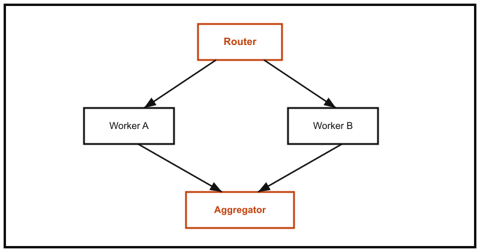

단일 에이전트에게 모든 역할을 맡기면 프롬프트가 비대해지고, 작업마다 필요한 도구·컨텍스트가 뒤섞여 성능이 떨어진다. LangGraph는 이 문제를 상태 기반 그래프로 풀어, 역할이 분리된 여러 에이전트를 명시적인 흐름으로 연결할 수 있게 해준다.

## 라우터-워커 패턴

가장 기본적인 멀티 에이전트 구조는 요청을 분류하는 라우터와, 분류된 작업을 처리하는 워커들로 나누는 것이다.



라우터는 들어온 요청을 어떤 워커에게 보낼지 점수화해서 결정한다. $n$개의 워커 후보가 있을 때, 각 워커로 보낼 확률은 다음과 같이 softmax로 정규화한다.

$$
P(\text{worker}_i \mid x) = \frac{\exp(s_i(x))}{\sum_{j=1}^{n} \exp(s_j(x))}
$$

$s_i(x)$는 라우터 LLM(또는 분류기)이 입력 $x$에 대해 워커 $i$가 얼마나 적합한지 매긴 점수다.

## 코드: StateGraph 기본 골격

```python
from typing import TypedDict
from langgraph.graph import StateGraph, END


class AgentState(TypedDict):
    query: str
    route: str
    result: str


def router(state: AgentState) -> AgentState:
    # 실제로는 LLM 호출로 분류한다. 여기서는 규칙 기반으로 단순화했다.
    route = "worker_a" if "코드" in state["query"] else "worker_b"
    return {**state, "route": route}


def worker_a(state: AgentState) -> AgentState:
    return {**state, "result": f"[A] '{state['query']}' 처리 완료"}


def worker_b(state: AgentState) -> AgentState:
    return {**state, "result": f"[B] '{state['query']}' 처리 완료"}


graph = StateGraph(AgentState)
graph.add_node("router", router)
graph.add_node("worker_a", worker_a)
graph.add_node("worker_b", worker_b)

graph.set_entry_point("router")
graph.add_conditional_edges("router", lambda s: s["route"], {
    "worker_a": "worker_a",
    "worker_b": "worker_b",
})
graph.add_edge("worker_a", END)
graph.add_edge("worker_b", END)

app = graph.compile()
print(app.invoke({"query": "이 함수의 코드를 리뷰해줘", "route": "", "result": ""}))
```

LangGraph API는 버전마다 세부 문법이 바뀌므로, 실제 프로젝트에 적용하기 전에 [공식 문서](https://langchain-ai.github.io/langgraph/)에서 최신 시그니처를 확인한다.

## 노드 역할 비교

| 노드 | 역할 | 실패 시 처리 |
|---|---|---|
| Router | 입력을 분석해 적절한 워커로 분기 | 기본 워커로 폴백 |
| Worker | 실제 작업 수행 (도구 호출, 생성 등) | 재시도 또는 에러 상태 반환 |
| Aggregator | 여러 워커 결과를 하나로 합산·정리 | 부분 결과라도 반환 |

## 요약

라우터-워커 패턴은 가장 단순한 멀티 에이전트 구조지만, 여기에 병렬 워커 호출·재시도·사람 개입(human-in-the-loop) 노드를 추가하면 실무에서 쓰는 복잡한 에이전트 파이프라인의 기본 골격이 된다.
