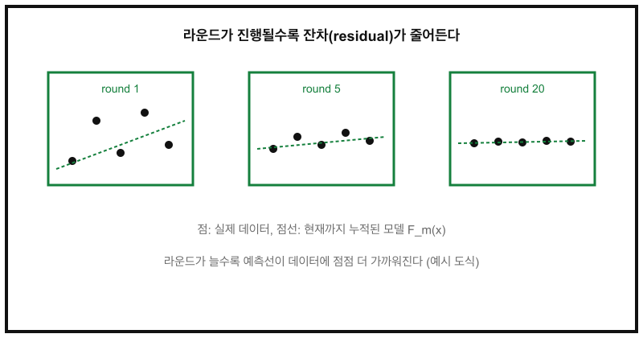

그래디언트 부스팅은 약한 학습기(weak learner)를 하나씩 순차적으로 더해가며, 이전 모델이 못 맞춘 부분(잔차)을 다음 모델이 보완하도록 학습하는 앙상블 기법이다. XGBoost, LightGBM, CatBoost 모두 이 아이디어의 변형이다.

## 핵심 아이디어

라운드를 거듭할수록 누적 모델이 데이터에 점점 가까워진다.



## 수식

$m$번째 라운드까지 누적된 모델 $F_m$은 이전 모델에 새 학습기 $h_m$을 학습률 $\nu$만큼 더해 만든다.

$$
F_m(x) = F_{m-1}(x) + \nu \, h_m(x)
$$

$h_m$은 손실 함수 $L$의 음의 그래디언트, 즉 잔차를 예측하도록 학습된다.

$$
h_m \approx \arg\min_h \sum_{i=1}^{N} \left( -\frac{\partial L(y_i, F_{m-1}(x_i))}{\partial F_{m-1}(x_i)} - h(x_i) \right)^2
$$

제곱 오차 손실을 쓰면 이 그래디언트가 정확히 잔차 $y_i - F_{m-1}(x_i)$가 되어, "잔차를 다음 모델이 예측한다"는 직관과 정확히 일치한다.

## 코드: 아주 단순한 부스팅 구현

결정 그루터기 대신 1차 다항식을 약한 학습기로 써서 부스팅의 핵심 루프만 남긴 예시다.

```python
import numpy as np


def fit_boosting(X, y, n_rounds=20, lr=0.1):
    F = np.zeros_like(y, dtype=float)
    models = []

    for _ in range(n_rounds):
        residual = y - F
        # 약한 학습기: 잔차에 대한 1차 최소제곱 근사
        coef = np.polyfit(X, residual, deg=1)
        h = np.polyval(coef, X)

        F += lr * h
        models.append(coef)

    return models


def predict(models, X, lr=0.1):
    F = np.zeros_like(X, dtype=float)
    for coef in models:
        F += lr * np.polyval(coef, X)
    return F
```

`lr`(학습률)이 작을수록 한 라운드가 결과에 미치는 영향이 줄어드는 대신, 더 많은 라운드로 세밀하게 맞출 수 있다.

## 주요 하이퍼파라미터

| 파라미터 | 역할 | 값이 클 때 |
|---|---|---|
| `n_estimators` | 부스팅 라운드(추가할 학습기 수) | 과적합 위험 증가 |
| `learning_rate` | 각 라운드가 반영되는 비율 | 적을수록 안정적이나 라운드 수 필요 |
| `max_depth` | 각 약한 학습기(트리)의 깊이 | 표현력 증가, 과적합 위험 증가 |
| `subsample` | 라운드마다 사용할 데이터 비율 | 1.0이면 전체 데이터 사용 |

## 요약

그래디언트 부스팅은 "잔차를 다음 모델이 보완한다"는 단순한 아이디어를, 임의의 미분 가능한 손실 함수로 일반화한 프레임워크다. `learning_rate`와 `n_estimators`를 함께 조절하는 것이 성능과 학습 시간의 균형을 잡는 핵심이다.
