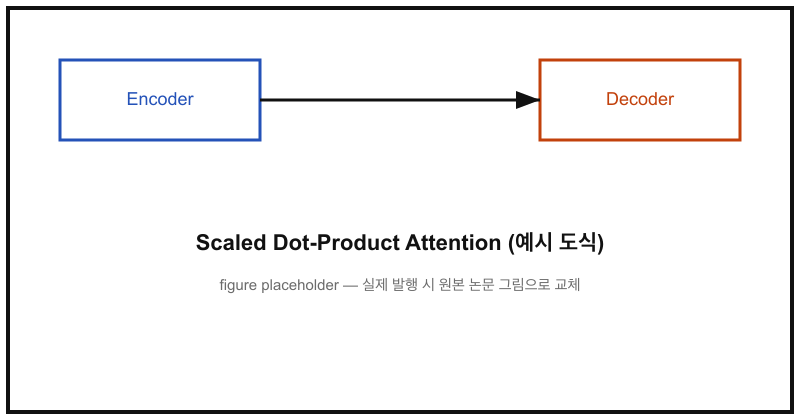

Transformer는 RNN·CNN 없이 오직 attention만으로 시퀀스를 처리하는 구조를 제안한 논문이다. 이 글에서는 핵심 아이디어인 Scaled Dot-Product Attention을 수식과 코드로 함께 정리한다.

## 핵심 아이디어

인코더-디코더 구조에서 각 위치가 입력 시퀀스 전체를 직접 참조할 수 있도록, self-attention을 반복해서 쌓는다.



## 수식

Query, Key, Value 행렬이 주어졌을 때 attention은 다음과 같이 계산된다.

$$
\text{Attention}(Q, K, V) = \text{softmax}\left(\frac{QK^\top}{\sqrt{d_k}}\right)V
$$

$d_k$가 커질수록 내적 값의 분산이 커져 softmax의 기울기가 사라지는 문제가 생기는데, $\sqrt{d_k}$로 나누는 스케일링이 이를 완화한다. 여러 head를 병렬로 두는 Multi-Head Attention은 다음과 같이 정의된다.

$$
\text{MultiHead}(Q, K, V) = \text{Concat}(\text{head}_1, \dots, \text{head}_h)W^O
$$

## 코드 구현

```python
import numpy as np

def scaled_dot_product_attention(q, k, v, mask=None):
    d_k = q.shape[-1]
    scores = q @ k.transpose(-2, -1) / np.sqrt(d_k)

    if mask is not None:
        scores = np.where(mask == 0, -1e9, scores)

    weights = np.exp(scores - scores.max(axis=-1, keepdims=True))
    weights /= weights.sum(axis=-1, keepdims=True)

    return weights @ v, weights
```

## 요약

| 구성 요소 | 역할 |
|---|---|
| Query / Key / Value | 입력을 세 개의 다른 표현으로 사영 |
| Scaled Dot-Product | 유사도 계산 후 소프트맥스로 가중치 산출 |
| Multi-Head | 서로 다른 표현 부분공간을 병렬로 탐색 |
| Positional Encoding | 순서 정보가 없는 attention에 위치 정보 주입 |

RNN 기반 모델 대비 병렬화가 쉬워 학습 속도가 크게 빨라졌고, 이후 BERT·GPT 계열 모델의 기반이 되었다.
